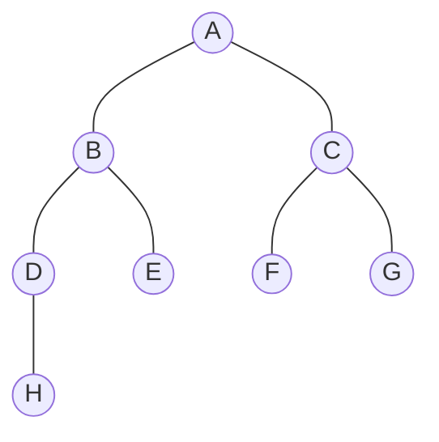
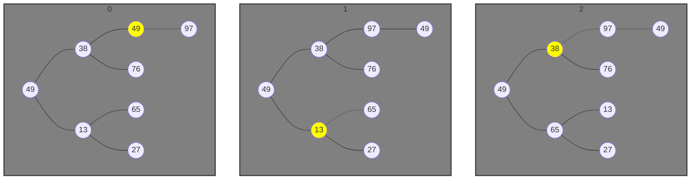
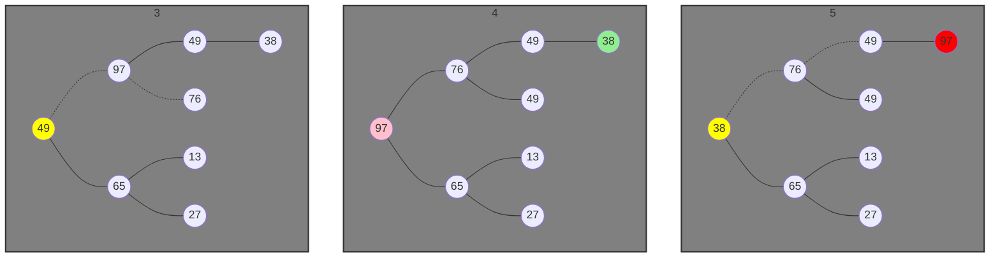

#### ArrayToHeap

```c
int arr[] = {A, B, C, D, E, F, G, H};
//      i = {0, 1, 2, 3, 4, 5, 6, 7};

// liftLeafNodeIndex  = 2 * currentNodeIndex + 1;
// rightLeafNodeIndex = 2 * currentNodeIndex + 2;
```



#### HeapAdjust

```c
int arr[] = {49, 38, 13, 49, 76, 65, 27, 97};
// 构建大顶堆
int res[] = {97, 76, 65, 49, 49, 13, 27, 38};
```

- <span style='color: pink'>冻结前</span>、<span style='color: red'>冻结</span>、<span style='color: lightgreen'>取代冻结点</span>、<span style='color: yellow'>调整节点</span>





- 0-4为构建大顶堆
- 4为构建大顶堆的结果
- 从4开始为调整大顶堆
