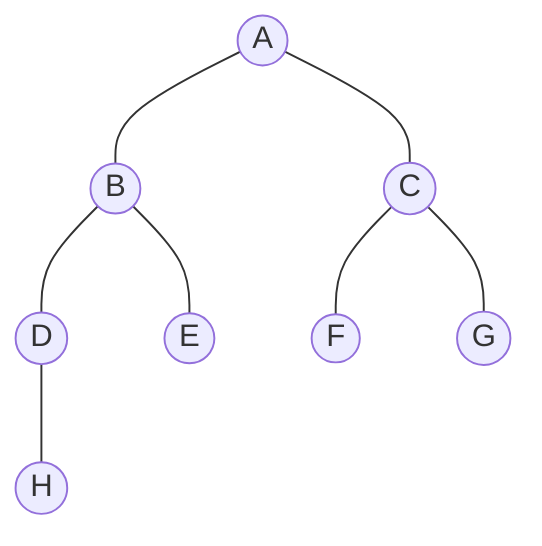
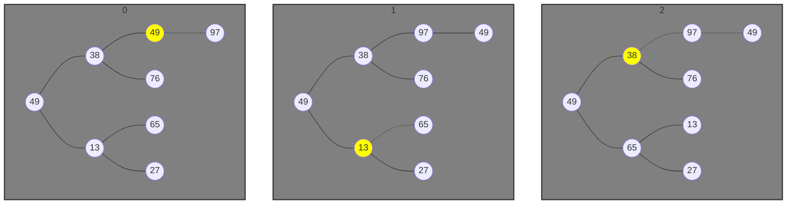
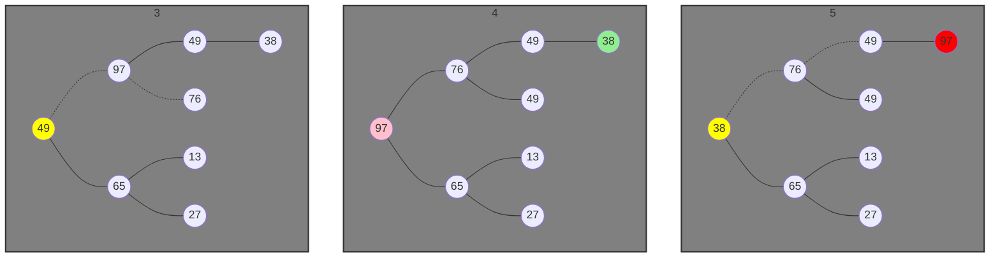

<link rel="stylesheet" href="https://zhmhbest.gitee.io/hellomathematics/style/index.css">
<script src="https://zhmhbest.gitee.io/hellomathematics/style/index.js"></script>

# [内排序算法](../index.html)

[TOC]

## 插入排序

### 直接插入排序

<table>
<thead><tr>
    <td>算法</td>
    <td>完全随机</td>
    <td>基本有序</td>
    <td>逆排序</td>
    <td>少有不同</td>
</tr></thead>
<tbody><tr>
    <td>插入排序</td>
    <td><image alt="sorting" src="./images/animation/20/random-initial-order/insertion-sort.gif"/></td>
    <td><image alt="sorting" src="./images/animation/20/nearly-sorted-initial-order/insertion-sort.gif"/></td>
    <td><image alt="sorting" src="./images/animation/20/reversed-initial-order/insertion-sort.gif"/></td>
    <td><image alt="sorting" src="./images/animation/20/few-unique-keys/insertion-sort.gif"/></td>
</tr></tbody>
</table>

- 稳定
- $O(1)$额外空间
- 时间复杂度：$O(n^2)$
  - 序列完全正序：仅需比较$n-1$次
  - 序列完全逆序：比较$\sum\nolimits_{i=2}^{n}i$次、移动$\sum\nolimits_{i=2}^{n}(i+1)$次
  - 序列基本有序：$O(n)$
- 适应性：随着排序的的进行，序列变得基本有序，算法效率逐渐提高。

@import "src/straight_insertion_sort.c"

### 折半插入排序

略

### 希尔排序

<table>
<thead><tr>
    <td>算法</td>
    <td>完全随机</td>
    <td>基本有序</td>
    <td>逆排序</td>
    <td>少有不同</td>
</tr></thead>
<tbody><tr>
    <td>希尔排序</td>
    <td><image alt="sorting" src="./images/animation/20/random-initial-order/shell-sort.gif"/></td>
    <td><image alt="sorting" src="./images/animation/20/nearly-sorted-initial-order/shell-sort.gif"/></td>
    <td><image alt="sorting" src="./images/animation/20/reversed-initial-order/shell-sort.gif"/></td>
    <td><image alt="sorting" src="./images/animation/20/few-unique-keys/shell-sort.gif"/></td>
</tr></tbody>
</table>

- 不稳定
- $O(1)$额外空间
- 大概时间复杂度：$O(n^{\frac{3}{2}})$（由于数学问题，无法准确描述）
- 适应性：由于希尔排序基于插入排序，希尔排序继承了插入排序的自适应性，但适应性较直接插入排序弱。

@import "./src/shell_insertion_sort.c"

## 选择排序

### 简单选择排序

>在交换单位的消耗成本很高的应用中，选择排序很可能也是合适的算法选择。

<table>
<thead><tr>
    <td>算法</td>
    <td>完全随机</td>
    <td>基本有序</td>
    <td>逆排序</td>
    <td>少有不同</td>
</tr></thead>
<tbody><tr>
    <td>选择排序</td>
    <td><image alt="sorting" src="./images/animation/20/random-initial-order/selection-sort.gif"/></td>
    <td><image alt="sorting" src="./images/animation/20/nearly-sorted-initial-order/selection-sort.gif"/></td>
    <td><image alt="sorting" src="./images/animation/20/reversed-initial-order/selection-sort.gif"/></td>
    <td><image alt="sorting" src="./images/animation/20/few-unique-keys/selection-sort.gif"/></td>
</tr></tbody>
</table>

- 不稳定
- $O(1)$额外空间
- 时间复杂度：$O(n^2)$
- 不适应性

@import "./src/simple_selection_sort.c"

### 树形选择排序

略

### 堆排序

<table>
<thead><tr>
    <td>算法</td>
    <td>完全随机</td>
    <td>基本有序</td>
    <td>逆排序</td>
    <td>少有不同</td>
</tr></thead>
<tbody><tr>
    <td>堆排序</td>
    <td><image alt="sorting" src="./images/animation/20/random-initial-order/heap-sort.gif"/></td>
    <td><image alt="sorting" src="./images/animation/20/nearly-sorted-initial-order/heap-sort.gif"/></td>
    <td><image alt="sorting" src="./images/animation/20/reversed-initial-order/heap-sort.gif"/></td>
    <td><image alt="sorting" src="./images/animation/20/few-unique-keys/heap-sort.gif"/></td>
</tr></tbody>
</table>

- 不稳定
- $O(1)$额外空间
- $O(n \cdot \log_{2}n)$时间
- 没有真正适应

@import "./src/heap_selection_sort.c"

#### ArrayToHeap

```c
int arr[] = {A, B, C, D, E, F, G, H};
//      i = {0, 1, 2, 3, 4, 5, 6, 7};

// liftLeafNodeIndex  = 2 * currentNodeIndex + 1;
// rightLeafNodeIndex = 2 * currentNodeIndex + 2;
```



#### HeapAdjust

```c
int arr[] = {49, 38, 13, 49, 76, 65, 27, 97};
// 构建大顶堆
int res[] = {97, 76, 65, 49, 49, 13, 27, 38};
```

- <span style='color: pink'>冻结前</span>、<span style='color: red'>冻结</span>、<span style='color: lightgreen'>取代冻结点</span>、<span style='color: yellow'>调整节点</span>





- 0-4为构建大顶堆
- 4为构建大顶堆的结果
- 从4开始为调整大顶堆

## 交换排序

### 冒泡排序

<table>
<thead><tr>
    <td>算法</td>
    <td>完全随机</td>
    <td>基本有序</td>
    <td>逆排序</td>
    <td>少有不同</td>
</tr></thead>
<tbody><tr>
    <td>冒泡排序</td>
    <td><image alt="sorting" src="./images/animation/20/random-initial-order/bubble-sort.gif"/></td>
    <td><image alt="sorting" src="./images/animation/20/nearly-sorted-initial-order/bubble-sort.gif"/></td>
    <td><image alt="sorting" src="./images/animation/20/reversed-initial-order/bubble-sort.gif"/></td>
    <td><image alt="sorting" src="./images/animation/20/few-unique-keys/bubble-sort.gif"/></td>
</tr></tbody>
</table>

- 稳定
- $O(1)$额外空间
- 时间复杂的：$O(n^2)$
  - 基本有序：$O(n)$
- 适应性

@import "./src/bubble_swap_sort.c"

### 快速排序

>通过一趟排序将要排序的数据分割成独立的两部分，其中一部分的所有数据都比另外一部分的所有数据都要小。

<table>
<thead><tr>
    <td>算法</td>
    <td>完全随机</td>
    <td>基本有序</td>
    <td>逆排序</td>
    <td>少有不同</td>
</tr></thead>
<tbody><tr>
    <td>快速排序</td>
    <td><image alt="sorting" src="./images/animation/20/random-initial-order/quick-sort.gif"/></td>
    <td><image alt="sorting" src="./images/animation/20/nearly-sorted-initial-order/quick-sort.gif"/></td>
    <td><image alt="sorting" src="./images/animation/20/reversed-initial-order/quick-sort.gif"/></td>
    <td><image alt="sorting" src="./images/animation/20/few-unique-keys/quick-sort.gif"/></td>
</tr></tbody>
</table>

- 不稳定
- $O(\log_{2}n)$额外空间
- 时间复杂度：$O(n^2)$，但通常$O(n \cdot log_{2}n)$
- 没有真正适应

@import "./src/quick_swap_sort.c"

### 快速排序三平均

<table>
<thead><tr>
    <td>算法</td>
    <td>完全随机</td>
    <td>基本有序</td>
    <td>逆排序</td>
    <td>少有不同</td>
</tr></thead>
<tbody><tr>
    <td>快速排序三平均</td>
    <td><image alt="sorting" src="./images/animation/20/random-initial-order/quick-sort-3-way.gif"/></td>
    <td><image alt="sorting" src="./images/animation/20/nearly-sorted-initial-order/quick-sort-3-way.gif"/></td>
    <td><image alt="sorting" src="./images/animation/20/reversed-initial-order/quick-sort-3-way.gif"/></td>
    <td><image alt="sorting" src="./images/animation/20/few-unique-keys/quick-sort-3-way.gif"/></td>
</tr></tbody>
</table>

- 不稳定
- $O(\log_{2}n)$额外空间
- 时间复杂度：$O(n^2)$，但通常$O(n \cdot log_{2}n)$
- 自适应：当有$O(1)$个**Unique Keys**时需要，$O(n)$时间

## 归并排序

<table>
<thead><tr>
    <td>算法</td>
    <td>完全随机</td>
    <td>基本有序</td>
    <td>逆排序</td>
    <td>少有不同</td>
</tr></thead>
<tbody><tr>
    <td>归并排序</td>
    <td><image alt="sorting" src="./images/animation/20/random-initial-order/merge-sort.gif"/></td>
    <td><image alt="sorting" src="./images/animation/20/nearly-sorted-initial-order/merge-sort.gif"/></td>
    <td><image alt="sorting" src="./images/animation/20/reversed-initial-order/merge-sort.gif"/></td>
    <td><image alt="sorting" src="./images/animation/20/few-unique-keys/merge-sort.gif"/></td>
</tr></tbody>
</table>

- 稳定性
- 数组要$O(n)$额外空间；链表要$O(\log_{2}n)$额外空间
- $O(n \cdot \log_{2}n)$时间
- 不自适应
- 不需要随机接入数据

## 基数排序

略
