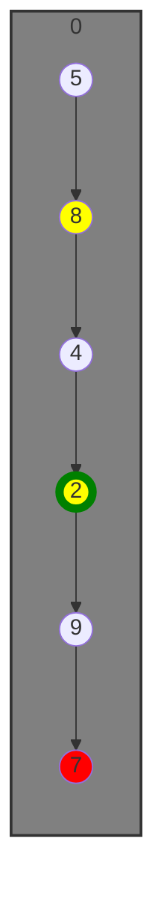
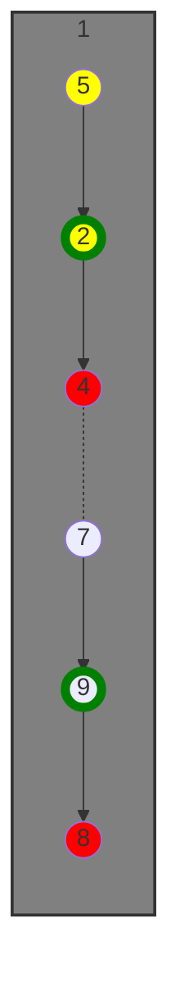
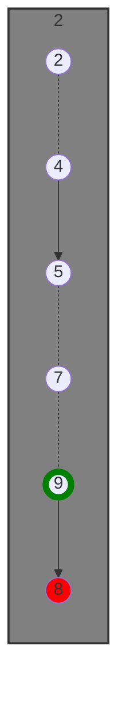
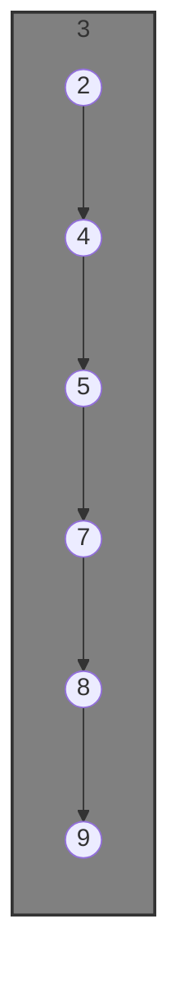

#### Partition

- 交换点之间交换
- 冻结和中点交换

```mermaid
graph LR
    subgraph 0
        style 0 stroke:#333,stroke-width:2px,fill:grey;
        style B fill:yellow;
        style D fill:yellow;
        style F fill:red;
        style D stroke:green,stroke-width:6px;
        A((5))
        B((8))
        C((4))
        D((2))
        E((9))
        F((7))
        A-->B-->C-->D-->E-->F;
    end
```

 

```mermaid
graph LR
    subgraph 1
        style 1 stroke:#333,stroke-width:2px,fill:grey;
        style A fill:yellow;
        style B fill:yellow;
        style C fill:red;
        style B stroke:green,stroke-width:6px;
        A((5))
        B((2))
        C((4))
        style F fill:red;
        style E stroke:green,stroke-width:6px;
        D((7))
        E((9))
        F((8))
        A-->B-->C-.-D-->E-->F;
    end
```

 

```mermaid
graph LR
    subgraph 2
        style 2 stroke:#333,stroke-width:2px,fill:grey;
        style F fill:red;
        style E stroke:green,stroke-width:6px;
        A((2))
        B((4))
        C((5))
        D((7))
        E((9))
        F((8))
        A-.-B-->C-.-D-.-E-->F;
    end
```

 

```mermaid
graph LR
    subgraph 3
        style 3 stroke:#333,stroke-width:2px,fill:grey;
        A((2))
        B((4))
        C((5))
        D((7))
        E((8))
        F((9))
        A-->B-->C-->D-->E-->F;
    end
```
